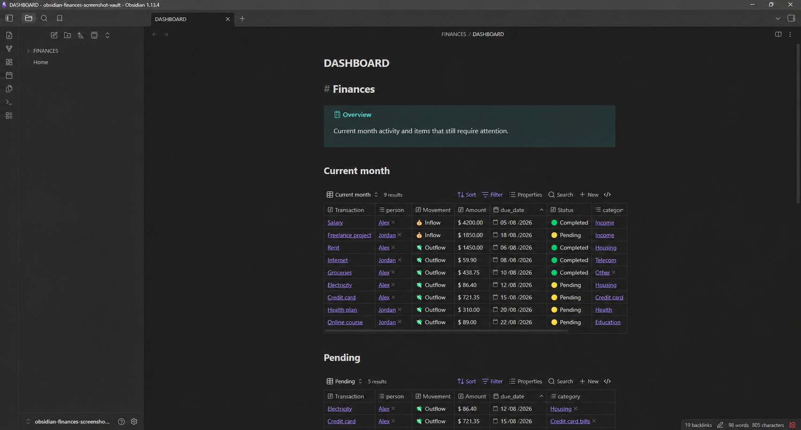
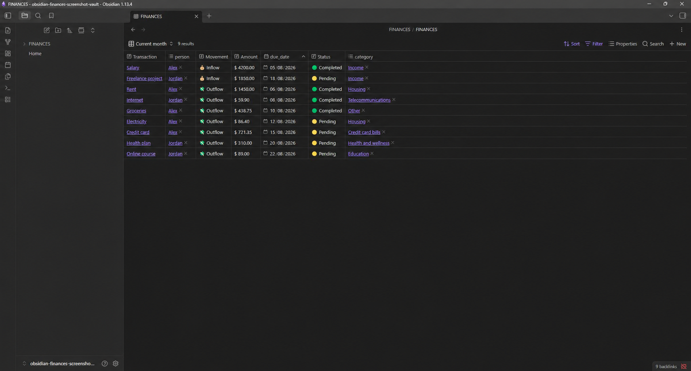
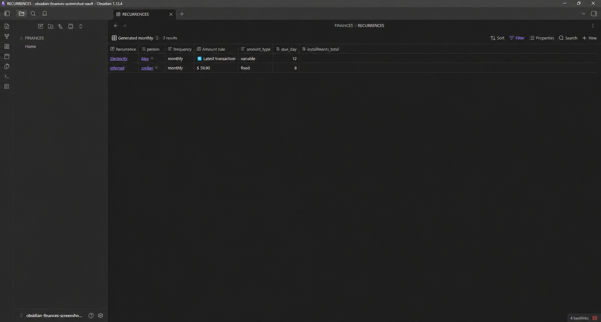

# Obsidian Finances Template

A local-first personal finance template for Obsidian, with payable and receivable tracking, recurring transactions, installments, dashboards, Bases, and QuickAdd workflows.

This repository contains an empty vault template. It includes no transactions, personal names, bank accounts, or real financial values.

## Features

- One Markdown file per transaction.
- Dashboard for the current month and pending items.
- Categories, people, periods, and recurrence rules connected through links.
- Fixed and variable recurring expenses.
- Idempotent generation of a new financial month.
- Installments and subscriptions already included in a credit card bill.
- Optional charts with Charts for Bases.

## Screenshots

All screenshots use fictitious people and values.

### Dashboard

### Transactions

### Recurrences

## Getting started

1. Read [docs/SETUP.md](docs/SETUP.md).
2. Copy the contents of `vault/` into a new or existing vault.
3. Create your people notes in `FINANCES/PEOPLE`.
4. Configure the two QuickAdd actions described in [docs/QUICKADD.md](docs/QUICKADD.md).
5. Open `FINANCES/DASHBOARD.md`.

## Documentation

- [Installation](docs/SETUP.md)
- [Data model](docs/SCHEMA.md)
- [Daily and monthly workflow](docs/WORKFLOW.md)
- [QuickAdd configuration](docs/QUICKADD.md)
- [Recurrence rules](docs/RECURRENCES.md)

## Requirements

- Obsidian with the built-in **Bases** plugin enabled.
- QuickAdd for automated workflows.
- Charts for Bases only if you want the chart views.

## License

Licensed under the [MIT License](LICENSE). You may use, modify, and distribute this template while retaining the license and copyright notice.
